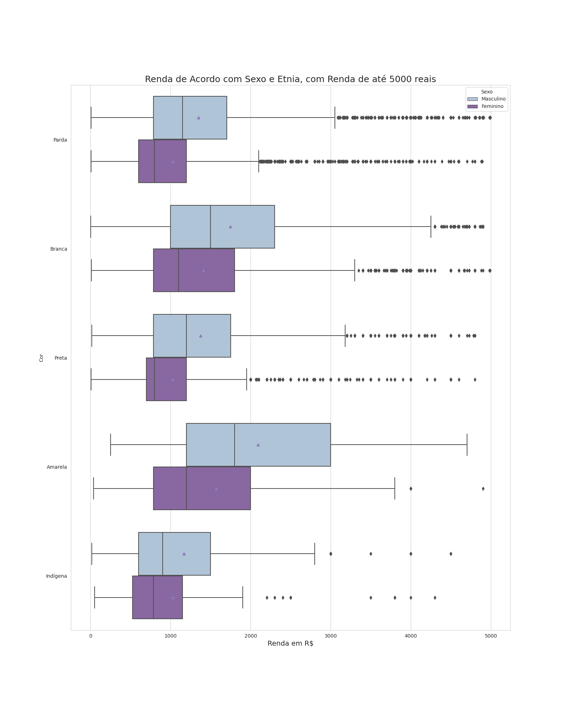
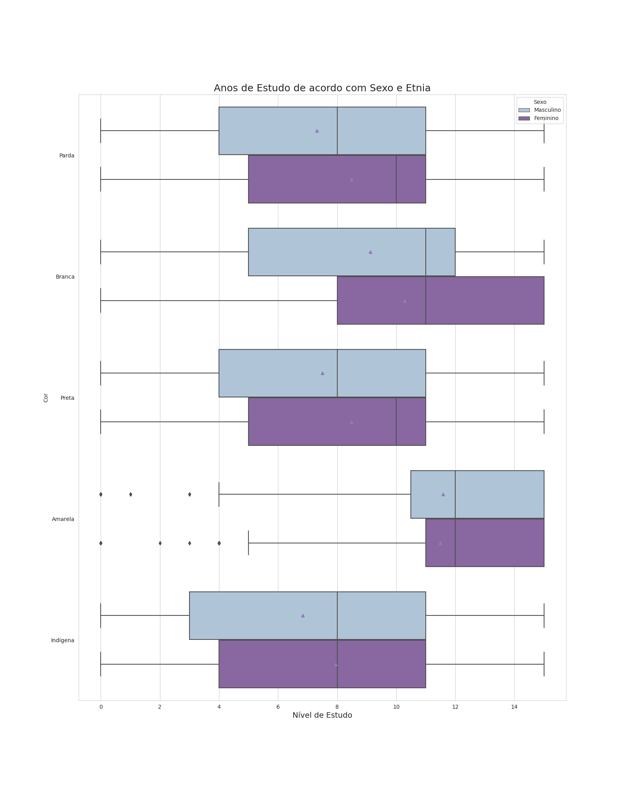

# Analisando a desigualdade de gênero no Brasil

> Status: Concluído

Análise com base na PNAD de 2015, com o conteúdo aprendido nos cursos de estatística com python da Alura. O objetivo do projeto é mostrar a desigualdade no Brasil.

| :placard: Vitrine.Dev |     |
| -------------  | --- |
| :sparkles: Nome        | **Desigualdade de Gênero no Brasil**
| :label: Tecnologias | Python, Jupyter Notebook

## Detalhes do Projeto

Foram utilizados dados da Pesquisa Nacional de Amostra a Domícilio de 2015 do IBGE para demonstrar a desigualdade de gênero no Brasil. Os treinamentos de estatística com Python da Alura serviram como base no desenvolvimento, assim como os dados da PNAD já tratados. Foram analisados como a distribuição de renda e nível de estudo variam dependendo do gênero, fazendo testes estatísticos, regressões e análises gráficas com boxplots e histogramas.O objetivo dessa análise foi simplesmente demonstrar de forma estatística que a desigualdade existe, sem discutir o porquê dela existir ou como solucionar esse problema.

## Alguns gráficos e análises

### Proporção entre homens e mulheres chefes de família

De acordo com a PNAD de 2015, aproximadamente 69,3% das famílias têm um homem como provedor principal, enquanto 30,7% têm uma mulher como provedora. O que é muito discrepante da proporção populacional entre homens e mulheres, além de que a maioria das famílias com uma mulher como chefe, são assim por conta da ausência da figura paterna.

### Renda por etnia e gênero

É notável que em todas as etnias, o gênero masculino acaba prevalecendo sobre o feminino nessa questão, sendo que a etnia amarela é aquela que possui a maior renda, seguida da etnia branca, parda, preta e indígena.

### Estudo por etnia e gênero

Já nesse gráfico representando os anos de estudo, podemos notar que no geral, as mulheres chefes de família possuem mais estudo que os homens na mesma posição. As etnias com mais estudo seguem o mesmo padrão da renda, sendo a etnia amarela com mais estudo, seguida pela branca, parda, preta e indígena.

### Usando regressão

Por fim, é possível usar regressão para representar a distribuição de renda no Brasil com fórmulas, claro que de forma pouco precisa, com o objetivo de somente constatar a desigualdade, visto que a renda é influenciada por muitos outros fatores. Usando somente os dados da PNAD 2015, considerando somente o estado de SP e pessoas com renda entre 300 e 10000, obtemos as seguintes fórmulas:

- **Geral: Renda = 534,06 + 166,97 * Anos de Estudo**
- **Homens: Renda = 668,53 + 175,21 * Anos de Estudo**
- **Mulheres: Renda = 78,30 + 165,54 * Anos de Estudo**

Com base nesses dados, uma mulher com ensino superior completo ganharia R$2.561,42, enquanto um homem na mesma posição teria uma renda de R$3.296,70, sendo uma diferença de R$735,28. Lembrando que esses dados não conseguem prever com precisão a renda de ninguém (ainda mais considerando que foram usados dados de 2015, e desde então houveram mudanças no valor do real e no poder de compra) e que estão sendo usados simplesmente para ilustrar a desigualdade de forma estatística.

---
